<!-- schweizerwilsemann/schweizerwilsemann -->

<div align="center">

</div>

```
╔══════════════════════════════════════════════════════════════════╗
║  $ whoami                                                        ║
║  > nguyen-duc-khoa  //  backend dev · devops · ai tinkerer      ║
║  > Ho Chi Minh City, Vietnam                                     ║
║  > currently: drinking milktea & shipping code                   ║
╚══════════════════════════════════════════════════════════════════╝
```

<br/>

<table>
<tr>
<td valign="top" width="55%">

### `./about_me.yml`

```yaml
alias:     schweizerwilsemann
role:      Backend Engineer
status:    building · learning · caffeinated

stack:
  infra:   [Docker, NGINX, Jenkins, Linux]
  langs:   [TypeScript, Python, Java, .NET]
  db:      [PostgreSQL, MySQL, MongoDB]
  web:     [Next.js, React, Tailwind CSS]

learning:
  - Rust
  - AI / RAG pipelines
  - Clean system design

debug_method: printf + rubber duck
fuel:          🧋 milktea, infinite supply
```

</td>
<td valign="top" width="45%">

### `./now.log`

```
[BUILDING]  scalable database systems
[STUDYING]  AI-powered dev tools
[READING]   Designing Data-Intensive Apps
[WATCHING]  too much anime, no regrets
[LISTENING] lo-fi · city pop · synthwave

──────────────────────────────────
 uptime:  24/7 (minus sleep maybe)
 mood:    [██████████] focused
 coffee:  [████░░░░░░] need refill
──────────────────────────────────
```

</td>
</tr>
</table>

<br/>

---

### `$ ls -la ./tech_stack/`

<br/>

<div align="center">

| Layer | Tools |
|:---|:---|
| **OS / Infra** |      |
| **Languages** |      |
| **Databases** |    |
| **Frontend** |    |

</div>

<br/>

---

### `$ cat ./stats.md`

<br/>

<div align="center">


&nbsp;&nbsp;


<br/><br/>


</div>

<br/>

---

### `$ ping ./contact`

<br/>

<div align="center">

```
┌─────────────────────────────────────────────────────┐
│  open to:  collaborations · interesting problems    │
│            backend consulting · building cool stuff │
│                                                     │
│  reach me: khoanguyenduc99@outlook.com              │
│            t.me/schweizerwilsemann                  │
│            linkedin.com/in/khoa-nguyen-016280323    │
└─────────────────────────────────────────────────────┘
```

[](mailto:khoa.qianyingya@gmail.com)
[](https://t.me/schweizerwilsemann)
[](https://www.linkedin.com/in/khoa-nguyen-016280323/)

<br/>

```
// thanks for stopping by
// star something if you find it useful
// connection request? always open.
```

</div>
